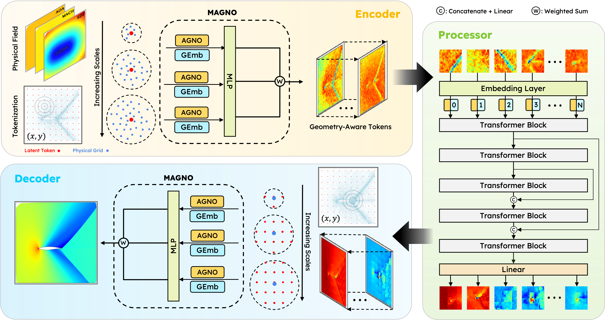
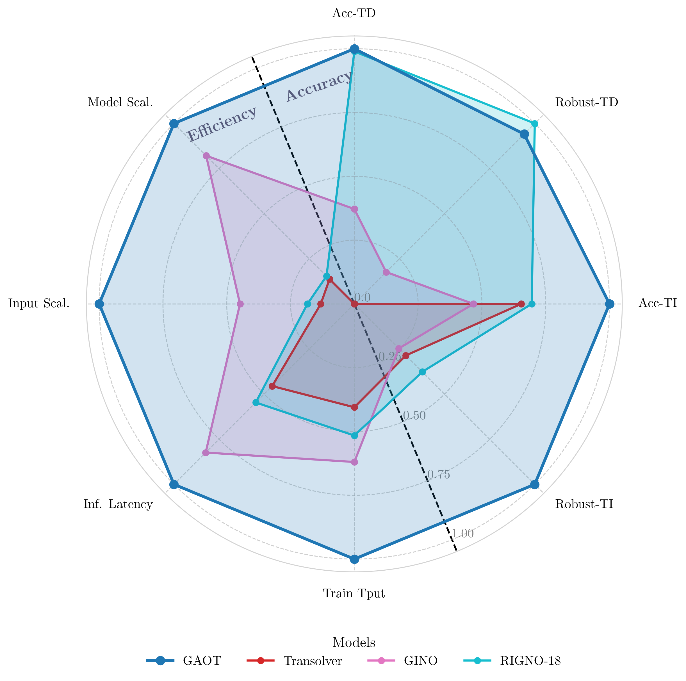
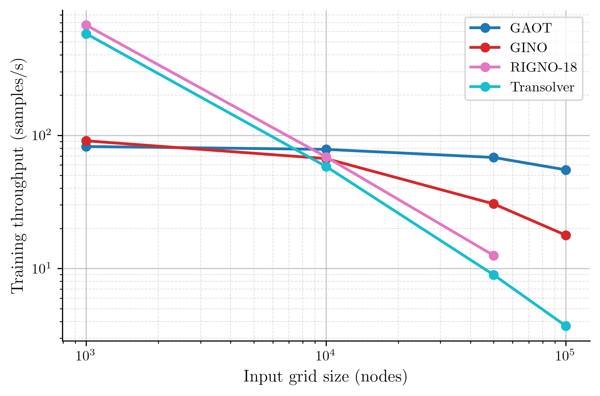
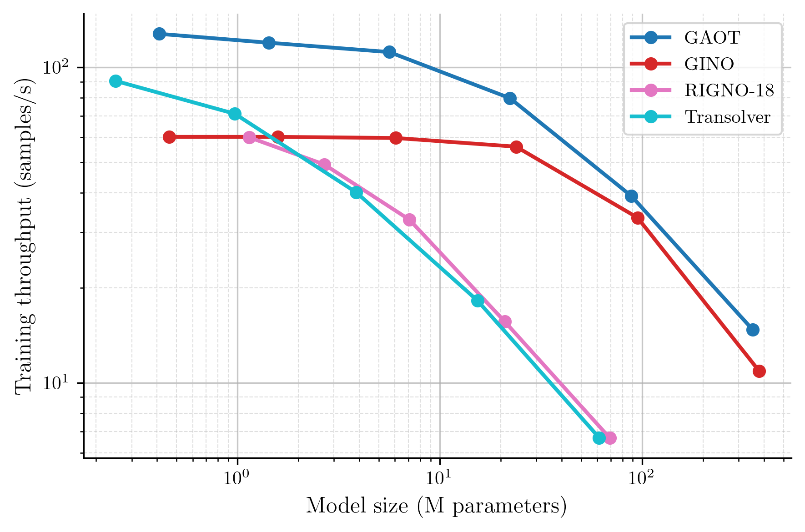

# :goat: GAOT: Geometry-Aware Operator Transformer

This repository contains the official source code for the paper:
**"Geometry Aware Operator Transformer As An Efficient And Accurate Neural Surrogate For PDEs On Arbitrary Domains"** 

For the optimized implementation of ultra-large 3D datasets with varying data resolution, e.g., DrivaerNet++, DrivaerML and NASA CRM, please refer to our other repository: [**GAOT3D**](https://github.com/Shizheng-Wen/GAOT-3D).

## :sparkles: Updates
***25/09/2025***
1. **GAOT has been accepted in NeurIPS 2025!** 🎉
2. **Open-Source Dataset**: We have open-sourced our dataset on [Hugging Face](https://huggingface.co/datasets/shiwen0710/Datasets_for_GAOT). We suggest running the examples we provided here to better understand the setup of the code before testing your own dataset.
3. **To Be Updated**: The **GAOT3D** repo will be merged into this repo in the following weeks.


***13/08/2025***
1.  **Unified Architecture**: Complete refactoring with unified trainers supporting both 2D/3D coordinates and fixed/variable coordinate modes
2. **Sequential Data Support**: New comprehensive support for time-dependent datasets with autoregressive prediction
3. **Streamlined API**: Simplified configuration system with automatic coordinate mode detection
4. **Better Performance**: Optimized data processing pipeline


## :bulb: Abstract

Learning solution operators of PDEs on arbitrary domains accurately and efficiently is a critical yet challenging task in engineering and industrial simulations. While numerous operator learning algorithms exist, a trade-off often arises between accuracy and computational efficiency. This work introduces the Geometry-Aware Operator Transformer (GAOT) to address this gap. GAOT integrates novel multiscale attentional graph neural operator encoders and decoders with geometry embeddings and (vision) transformer processors. This combination allows GAOT to accurately map domain information and input parameters to robust approximations of PDE solutions. Furthermore, several implementation innovations ensure GAOT's computational efficiency and scalability. We demonstrate significant gains in both accuracy and efficiency over various baselines across a diverse set of PDE learning tasks, including achieving state-of-the-art performance on a large-scale three-dimensional industrial CFD dataset.

<p align="center">
  
  <br/>
  <em>Figure 1: GAOT Model Architecture.</em>
</p>


## :rocket: Key Features

* **Hybrid Architecture:** Combines the strengths of Graph Neural Operators (for geometry awareness) and Transformers (for global context modeling).
* **Multiscale Processing:** Employs multiscale attentional GNO encoders/decoders to capture features at different resolutions.
* **Geometry Embeddings:** Explicitly incorporates geometric information into the learning process.
* **Efficiency and Scalability:** Designed with computational performance in mind, enabling application to large and complex problems.
* **Versatility:** Adaptable to various PDE learning tasks with different geometric and temporal characteristics.


## 📈 Results

### Overall Model Performance

GAOT demonstrates superior performance across multiple metrics when compared to selected baselines (RIGNO-18 for Graph-based, GINO for FNO-based, and Transolver for Transformer-based models). The radar chart below provides a comprehensive overview.

<p align="center">
  
  <br/>
  <em>Figure 2: Normalized performance of GAOT and baselines across eight axes, covering accuracy (Acc.), robustness (Robust), throughput (Tput), scalability (Scal.) on time-dependent (TD) and time-independent (TI) tasks.</em>
</p>

### Throughput and Scalability

GAOT shows excellent throughput and scalability with increasing grid resolution and compared to other models.

<table align="center" style="border: none;">
  <tr>
    <td align="center" width="50%" style="border: none;">
      <br/>
      <em>Figure 3: Grid Resolution vs. Throughput.</em>
    </td>
    <td align="center" width="50%" style="border: none;">
      <br/>
      <em>Figure 4: Model vs. Throughput.</em>
    </td>
  </tr>
</table>


## :gear: Installation

1.  **Create and activate a virtual environment (recommended):**
    ```bash
    python -m venv venv-gaot
    source venv-gaot/bin/activate  
    ```

2.  **Install dependencies:**
    ```bash
    pip install -r requirements.txt
    ```
    *Ensure PyTorch is installed according to your system's CUDA version if GPU support is needed.*
    
    For PyG-related packages (e.g., torch-scatter), run:
    ```bash
    pip install torch-scatter -f https://data.pyg.org/whl/torch-2.7.0+${CUDA}.html
    pip install torch-cluster -f https://data.pyg.org/whl/torch-2.7.0+${CUDA}.html
    ```
    Replace ${CUDA} with your CUDA version (e.g., cu128, cu121 or cpu).


## :floppy_disk: Dataset Setup

Organize your datasets (typically in NetCDF `.nc` format) in a directory structure like the one shown below. Dataset related to this paper can be downloaded from the [HuggingFace Page](https://huggingface.co/datasets/shiwen0710/Datasets_for_GAOT). You will specify `your_base_dataset_directory/` in the configuration files. For example, put your data into the `datasets/` folder.

``` 
.../datasets/
    |__ time_indep/
        |__ Poisson-Gauss.nc
        |__ naca0012.nc
        |__ ...
    |__ time_dep/
        |__ ns_gauss.nc
        |__ ...
```
## :open_book: How to Use

### Configuration

All experiment parameters are managed via configuration files (JSON or TOML format) located in the `config/` directory.

**Key Configuration Parameters:**

* **`dataset.base_path`**: Path to `your_base_dataset_directory/` where your `.nc` files are stored.
* **`dataset.name`**: Name of the dataset file (e.g., "Poisson-Gauss" for "Poisson-Gauss.nc").
* **`setup.train`**: Set to `true` for training, `false` for inference/testing.
* **`setup.test`**: Set to `true` for testing/inference (typically used when `setup.train: false`).
* **`path`**: Defines storage locations for checkpoints, loss plots, result visualizations, and the metrics database.

For a comprehensive list of all configuration options and their default values, please consult: `src/core/default_configs.py`.

#### Model and Trainer Selection

**Updated Unified System** - GAOT now uses a simplified, unified trainer system with automatic coordinate mode detection:

* **Trainer Selection (`setup.trainer_name`):**
    * **`static`**: Unified trainer for time-independent datasets (automatically detects fx/vx coordinate mode)
    * **`sequential`**: Unified trainer for time-dependent datasets with autoregressive prediction capabilities

* **Model Selection (`model.name`):**
    * **`gaot`**: Unified GAOT model supporting both 2D/3D coordinates and fx/vx modes

**Sequential Data Configuration** (for `sequential` trainer):
* **`dataset.max_time_diff`**: Maximum time steps for sequential training (default: 14)
* **`dataset.stepper_mode`**: Prediction mode - `"output"`, `"residual"`, or `"time_der"` (default: "output")
* **`dataset.predict_mode`**: Testing mode - `"autoregressive"`, `"direct"`, `"star"`, or `"all"` (default: "autoregressive")
* **`dataset.metric`**: Evaluation metric - `"final_step"` or `"all_step"` (default: "final_step")

The system automatically detects coordinate mode (fixed/variable) from your data, eliminating the need for manual specification. Example configurations can be found in the `config/examples/` directory.

### Training

To train a model, run `main.py` with the path to your configuration file:

```bash
python main.py --config [path_to_your_config_file.json_or_toml]
```
For example:
```bash
python main.py --config config/examples/time_indep/poisson_gauss.json
```
To run all configuration files within a specific folder:
```bash
python main.py --folder [path_to_your_config_folder]
```

Other `main.py` Command-Line Options:

* `--debug`: Enables debug mode (may alter multiprocessing behavior).
* `--num_works_per_device <int>`: Sets the number of parallel workers per device.
* `--visible_devices <int ...>`: Specifies CUDA devices to use (e.g., `--visible_devices 0 1`).

Training artifacts (checkpoints, logs, plots, metrics) will be saved to the directories specified in the `path` section of your configuration.

### Inference
To perform inference with a trained model:
1. Update your configuration file:
   * Set `setup.train: false`.
   * Set `setup.test: true`.
   * Ensure `path.ckpt_path` correctly points to the desired model checkpoint (`.pt`) file.
2. Execute `main.py` with the modified configuration:
   ```bash
   python main.py --config [path_to_your_config_file.json_or_toml]
   ```
## :file_folder: Project Structure

```
GAOT/
├── assets/                   # Images for README (e.g., architecture.png)
├── config/                   # Experiment configuration files (.json, .toml)
│   └── examples/             # Example configurations for different datasets
│       ├── time_indep/       # Time-independent problem configurations
│       └── time_dep/         # Time-dependent problem configurations
├── demo/                     # Jupyter notebooks, analysis scripts
├── src/                      # Refactored source code (unified architecture)
│   ├── core/                 # Base trainer classes and configuration management
│   │   ├── base_trainer.py   # Abstract base trainer class
│   │   ├── default_configs.py # Default configuration dataclasses
│   │   └── trainer_utils.py  # Shared trainer utilities
│   ├── datasets/             # Unified data processing and graph building
│   │   ├── data_processor.py # Base data processor for all modes
│   │   ├── sequential_data_processor.py # Specialized for time-dependent data
│   │   ├── graph_builder.py  # Graph construction utilities
│   │   └── data_utils.py     # Dataset classes and utilities
│   ├── model/                # Unified model definitions
│   │   ├── gaot.py          # Main GAOT model (supports 2D/3D, fx/vx)
│   │   └── layers/          # Neural network layer implementations
│   ├── trainer/              # Unified trainer implementations
│   │   ├── static_trainer.py    # For time-independent problems
│   │   └── sequential_trainer.py # For time-dependent problems
│   └── utils/                # Utilities for metrics, plotting, scaling
│       ├── metrics.py        # Error computation and evaluation
│       ├── plotting.py       # Advanced plotting and animation
│       └── scaling.py        # Coordinate normalization utilities
├── main.py                   # Main script to run experiments
├── requirements.txt          # Python package dependencies
└── README.md                 # This file
```

### Key Architecture Changes

- **Unified Trainers**: Single `static` and `sequential` trainers that automatically handle both fx/vx coordinate modes
- **Modular Design**: Clean separation between data processing, model definition, and training logic
- **Enhanced Visualization**: Support for both static plots and animated sequences for time-dependent data
- **Comprehensive Testing**: Full unit test coverage for reliable development and CI/CD
- **Automatic Detection**: Coordinate mode (fx/vx) and data dimensionality (2D/3D) detected automatically

## :link: Citation
If you use GAOT in your research, please cite our paper:
```
@article{wen2025goat,
  title        = {Geometry Aware Operator Transformer as an Efficient and Accurate Neural Surrogate for PDEs on Arbitrary Domains},
  author       = {Wen, Shizheng and Kumbhat, Arsh and Lingsch, Levi and Mousavi, Sepehr and Zhao, Yizhou and Chandrashekar, Praveen and Mishra, Siddhartha},
  year         = {2025},
  eprint       = {2505.18781},
  archivePrefix= {arXiv},
  primaryClass = {cs.LG}
}
```